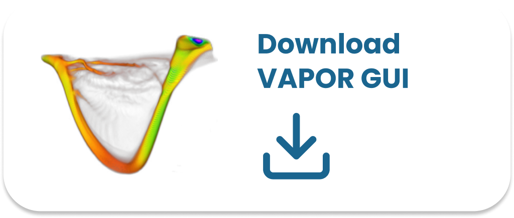
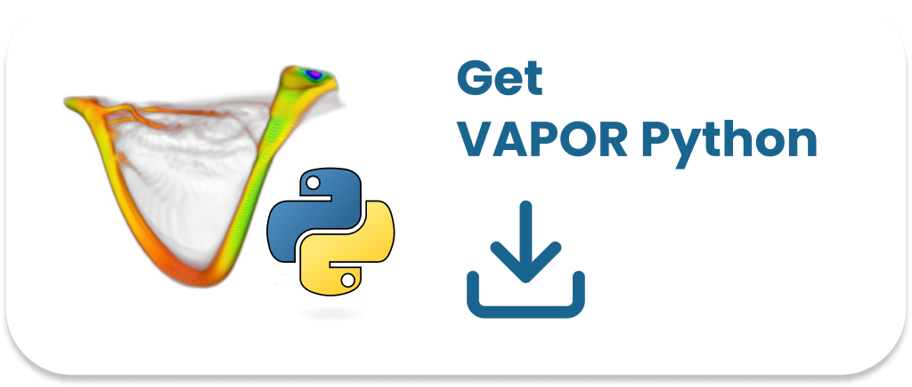

<!-- ## Download -->
## Download and Install

   

   

### Supported Platforms

||**MacOSx86**|**appleSilicon**|**Linux**|**Windows**|
| **VAPOR GUI**    	|✅|✅|✅|✅|
| **VAPOR Python** 	|✅|✅|✅|⛔️|

**Non-native support.*
